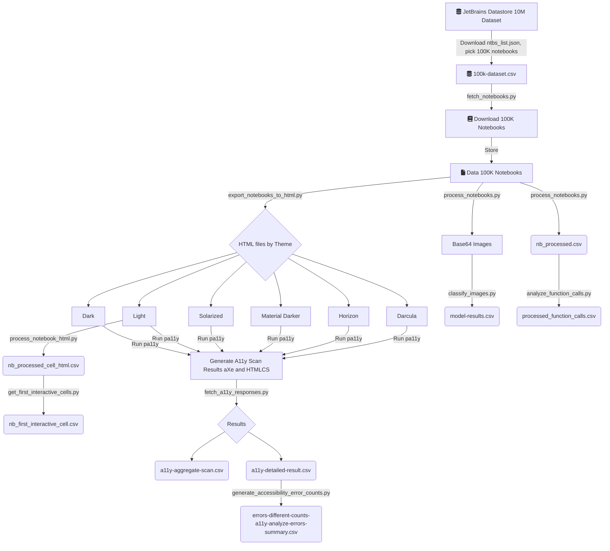

# Data Processing Pipeline

The various scripts listed here perform the data processing:

1. `fetch_a11y_responses.py`
   - This script expects `pa11y` to be executed and the results stored in a separate directory.
   - For the pipeline we store the results from the executions of `pa11y` in the `pa11y-results/` directory.
   - Input Requirements:
     - `BASE_PA11Y_RESULT_DIR`: The base directory where the results from the `pa11y` scans are stored. (eg. `pa11y-results/`)
     - `THEMES`: The set of themes being used to analyze. It is set to `['darcula', 'dark', 'horizon', 'light', 'material-darker', 'solarized']`
   - The result of this script is the following intermediate datasets over which additional analysis is run.
     - `data_out/a11y-aggregate-scan.csv` with the structure containing the following columns:
       - ID
       - Notebook
       - Theme
       - Standard
       - Date
       - Total
       - Errors
       - Warnings
       - Notices
     - `data_out/a11y-detailed-result.csv` with the structure containing the individual details of each error in the notebook and stored in a long table format with the following columns:
       - ID
       - Notebook
       - Theme
       - Runner
       - Type
       - TypeCode
       - DetailCode
       - Selector
       
     > :warning: The detailed result file can be really large (> 60 GB) and can be time-consuming to construct. We share this dataset from our scans for future research efforts.

   > :heavy_check_mark: For the paper, the execution of the pipeline processes 589746 `pa11y` scan results in 59 chunks and takes **2833.13** seconds (46 minutes) to generate the resulting datasets for further analysis on a 72 core vCPU AWS c5.18xlarge instance.

2. `generate_accessibility_error_counts.py`
   - This script expects the previous command to be run and uses the output from the previous stage of the pipeline as its input
     - For this part of the pipeline, we store the results from the executions in the `data_out` directory.
     - Input Requirements:
       - `DETAILED_ERROR_REPORT_FILE`: the file path of output of the previous stage of the pipeline 
     - The expected output:
       - `data_out/errors-different-counts-a11y-analyze-errors-summary.csv` with the structure containing counts of errors that notebooks have across different themes. The file contains in a long table format with the following columns:
         - Type
         - Theme
         - Runner
         - DetailCode
         - count

3. `classify_images.py`
   - This script uses the `FV-CNN+FC-CNN` based model (included at `model/epoch_9_loss_0.04706_testAcc_0.96867_X_resnext101_docSeg.pth`) and classifies the images in various notebooks into 28 different categories.
   - The execution of this script requires all the images/plots in the notebooks to be stored in their `base64` file formats in a single directory. (eg. `data-100k/base64Images/`)
   - During its execution the script loads the model on the GPU/CPU devices as available and configured and classifies all images.
   - Input Requirements:
     - `MODEL_PATH`: The trained FV-CNN+FC-CNN model to use
     - `IMAGE_STORE`: The directory containing all the `base64` encoded images as files.
   - The result of this script is the following intermediate dataset:
     - `data_out/model-result.csv` which contains the following columns:
       - `Name`: Path to the image of the format `prefix/<notebook_name>.ipynb-<index>.<image_extension>`
       - `Notebook Name`
       - `Category`: A single category classification among the 28 available with the highest prediction accuracy.
   
   > :warning: To analyze `342722` images on multiple GPUs the model can take hours after the dataset is sharded appropriately. Non sharded inference can take over a day. Exercise caution while running this task.

4. `process_notebook_html.py`
   - This script requires the `HTML` exported versions after `nbconvert` on the notebooks and stored in the respective directories.
   - As an example, we store the HTML files corresponding to the notebooks in `NOTEBOOKS_HTML_FORMAT` variable at location `serve/light/` corresponding to the `light/` default theme
   - The script parses each notebook's HTML file and extracts the required contents to create the dataset `data_out/nb_processed_cell_html.csv` containing the following columns:
     - `fileNames`: Path of the HTML exported notebook file.
     - `cell_seq_num`: Cell Sequence Number assigned in sequence of cells parsed.
     - `cellType`: Type of cell `markdown` or `code`
     - `_has_output`: Cell contains an attached output
     - `_output_contains_graphics`: Boolean indicating if the output contains graphics
     - `_output_contains_tables`: Boolean indicating if the output contains tables
     - `_has_interactive`: Output contains either a graphic or a table
     - `_has_heading`: Boolean indicating the existence of a heading
     - `_has_links`: Boolean indicating the existence of links (anchor tags)
     - `_has_math_latex`: Boolean indicating the usage of MathJax
     - `_code_lines`: Number of lines of code in a given cell
     - `_has_imports`: Boolean indicating the existence of `import` statements in the cell
     - `_cell_execution_order`: Integer field indicating the cell execution number
     - `_num_h<1|2|3|4|5|6>`: Number of H1, H2, H3, H4, H5, H6 headings
     - `_num_tables`: Number of tables
     - `_num_links`: Number of hyperlinks
     - `h<1|2|3|4|5|6>_texts`: Text content of the headings
     - `has_tables`: Boolean indicating the existence of a table
     - `has_math`: Boolean indicating the existence of math content in the HTML file
     - `num_math`: Number of math expressions expressed in Math typesetting in the HTML Notebooks
     - `alt_text`: Existing ALT text of the images in the Notebooks if any explicitly provided
    
    >    :warning: This is a long-running task and typically takes hours because of the repeated filtering by notebook name and can be easily optimized to work faster. Since this is however a one time task, we leave it as-is. This stage of the pipeline took **4014.08 seconds (1 hour 7 minutes)**

5. `get_first_interactive_cells.py`
   - This stage of the pipeline expects the previous step that generates `nb_processed_cell_html.csv` to be run, and it uses the file as input.
   - Running this script generates the file `nb_first_interactive_cell.csv` into the `data_out` directory.
   - Input requirements:
     - `nb_processed_cell_html.csv`, the output from the previous stage of the pipeline.
   - The expected output:
     - `data_out/nb_first_interactive_cell.csv` containing the data necessary to identify the first interactive element and its location in each notebook. The file contains the following columns:
       - `Filename`: the name of the notebook's html output file.
       - `H`: contains the text "Heading" if the notebook contains a heading. Value is None if cell does not contain a heading.
       - `SequenceNumber`: the cell sequence number in which this interactive element is present.
       - `HLevel`: the level of the heading. If the cell does not contain the heading, this value is None.
       - `T`: contains the text 'Table' if the cell contains a table. Value is none if cell does not contain a table.
       - `TSequenceNumber`: Cell number in which the table is located. Value is None if the cell does not contain a table.
       - `TDetail`: details of the table.
   > :warning: This current scripts to perform this check is compute intensive and can take a very long time. The script runs serially for correctness and due to its one time run nature of requirement, please parallelize as required if run time complexity needs improvement due to bottlenecks. This task currently takes **13697.41 seconds (3 hours 48 minutes)** to complete.

6. `analyze_function_calls.py`
   - This stage parses the code cells in the notebooks and understands the nature of imports and function calls being made in the notebooks.
   - Input requirements:
     - `BASE_DATA_DIR`: A directory containing the `.ipynb` notebook files. For example `data-100k/` contains 100K notebook files.
     - `NOTEBOOKS_WITH_FIGURE_OUTPUTS`: List of notebooks which contain atleast one generated graphic/image filtered into `nb_processed.csv`
   - The result of this script is the intermediate dataset:
     - `data_out/processed_function_calls.csv` which contains the following information:
       - `fileNames`: File name of the notebook
       - `language`: Programming language used in the notebook extracted from the Notebook metadata
       - `imports`: A JSON encoded list of python imports used in the notebook
       - `numImages`: Number of figures present in the notebook generated as outputs.
       - `functionCalls`: A JSON encoded list of function calls from the imported libraries.
       - `linesOfCode`: Number of lines of code in various notebook cells.
   > The total time taken to execute the script and generate the required dataset is **630.35 seconds (10 minutes 30 seconds)**

7. `process_notebooks.py`
   - This stage of the pipeline takes as input the notebook files in `BASE_DATA_DIR` and the input list of notebooks `input_data/100k-dataset.csv`
   - The result of this stage of the pipeline execution is:
     - `OUTPUT_IMAGE_DIRECTORY`: Containing `base64` encoded image files which are further processed during classification
     - `data_out/nb_processed.csv`: A flat file after processing each notebook resulting in 100K rows (excluding header) with the following structure:
       - `fileNames`: Filename of the notebook
       - `language`: Language used within the notebook
       - `imports`: JSON encoded list of imports
       - `num_images`: Total number of images/figures in the notebook
       - `output_metadata`: Metadata of output types in the notebook
       - `image_metadata`: Image specific metadata
       - `has_matplotlib`
       - `has_plotly`
       - `has_bokeh`
       - `code_lines`: JSON encoded list of number of code lines per cell in the notebook
       - `total_code_lines`: Total number of code lines `sum(code_lines)`
       - `markdown_lines`: JSON encoded list of number of markdown lines per cell in the notebook
       - `sum_markdown_lines`: Total number of markdown lines `sum(markdown_lines)`
   > This script takes a total of **936.07 seconds (15 minutes 36 seconds)** to execute and generate the required results.

## Pipeline Execution Plan

